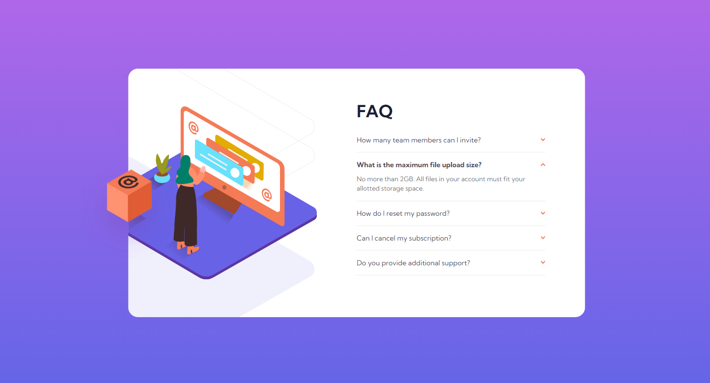

# Frontend Mentor - FAQ accordion card solution

This is a solution to the [FAQ accordion card challenge on Frontend Mentor](https://www.frontendmentor.io/challenges/faq-accordion-card-XlyjD0Oam). Frontend Mentor challenges help you improve your coding skills by building realistic projects.

## Table of contents

- [Screenshot](#screenshot)
- [Links](#links)
- [My process](#my-process)
  - [Built with](#built-with)
  - [What I learned](#what-i-learned)
  - [Continued development](#continued-development)
  - [Useful resources](#useful-resources)
- [Author](#author)

### Screenshot

### Links

- Solution URL: [Add solution URL here](https://github.com/alyssasitto/faq-card-project)
- Live Site URL: [Add live site URL here](https://faq-card-563891.netlify.app/)

## My process

### Built with

- Semantic HTML5 markup
- CSS custom properties
- Flexbox
- CSS Grid
- Mobile-first workflow

### What I learned

I learned how to create a drop down effect using javascript which is something I didn't know how to do before. I also learned how to give the svg image a transition when I opened each accordion.

### Continued development

I am going to constinue learnig how to use absolute and relative positioning along with transitions/transformations. I'm also going to continue learning how to use Javascript since I have very little knowledge of it right now.

### Useful resources

- [Example resource 1](https://www.youtube.com/watch?v=4qnWreynXLU&t=353s) - This video taught me how to give the accordions the dropdown effect with javascript

## Author

- Website - [Add your name here](https://faq-card-563891.netlify.app/)
- Frontend Mentor - [@alyssasitto](https://www.frontendmentor.io/profile/alyssasitto)
